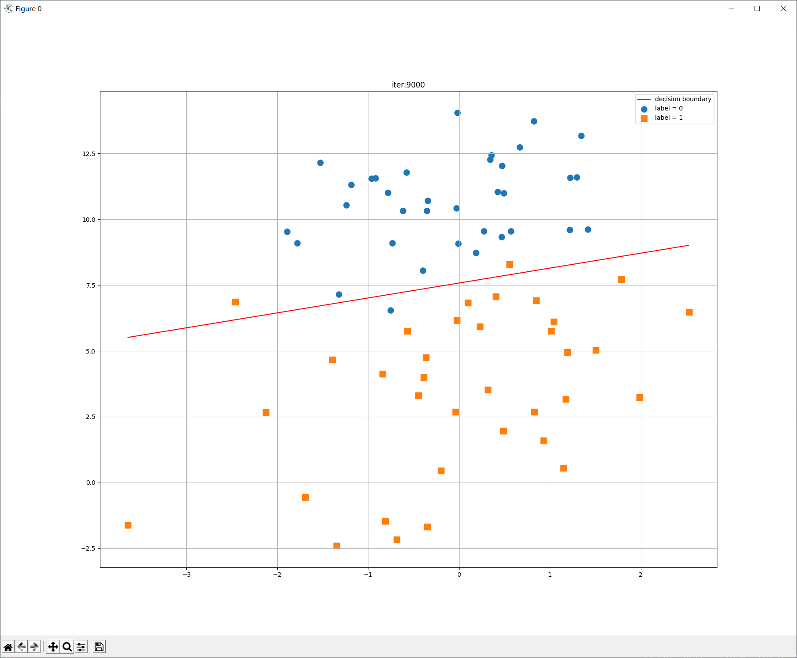
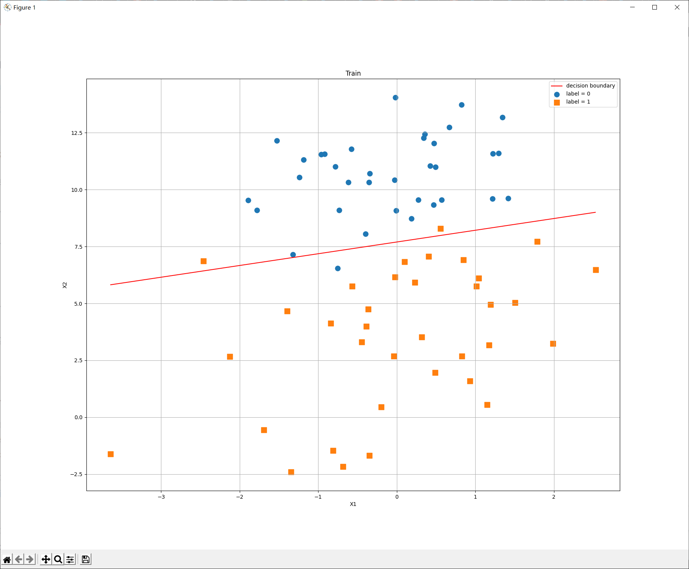
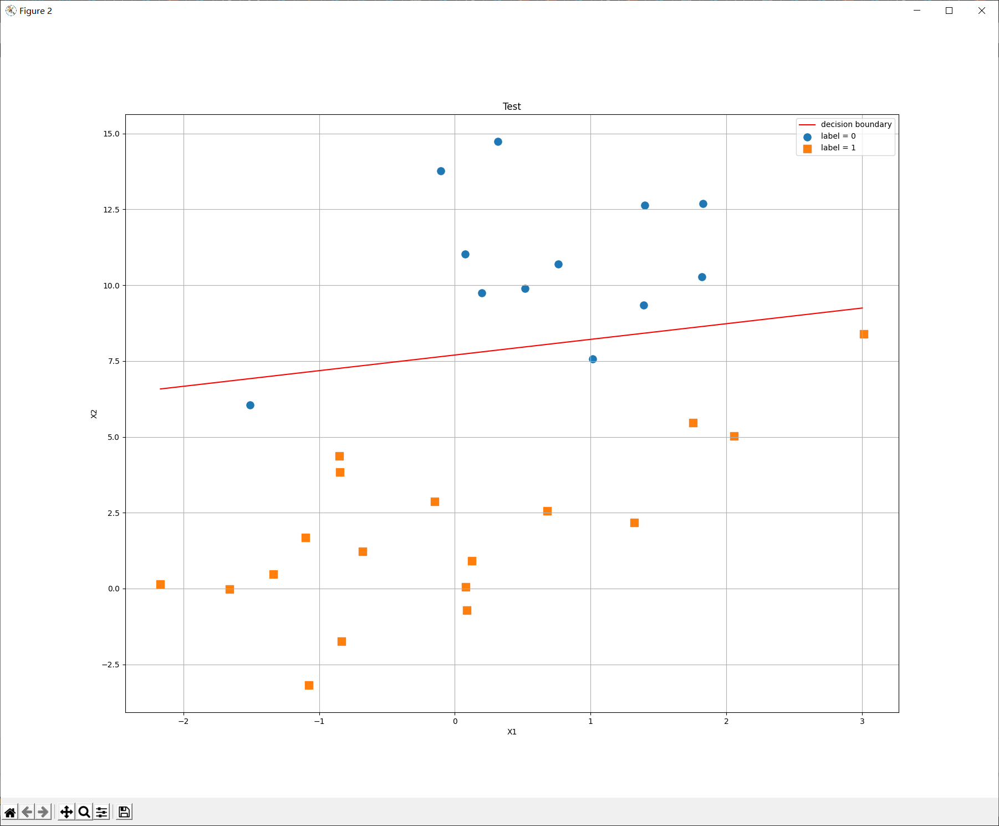

# LR实验

<center>PB18071477  敖旭扬</center>

## 原理

**LR (logistics regression) 模型**就是要给出一个 $W=(b;\boldsymbol{w})$ ，它对一个样本 $\hat{\boldsymbol{x}}=(1,\boldsymbol{x})$ ，计算得到一个预测值
$$
z=\hat{\boldsymbol{x}}W=w_1x_1+w_2x_2+\cdots+w_dx_d+b \tag{1}
$$

那么在所建立的模型（给定 $W$ ）下，样本 $\hat{\boldsymbol{x}}$ 为正类的概率为
$$
P(Y=1|\hat{\boldsymbol{x}},W)=sigmoid(z) \tag{2}
$$
为反类的概率为 
$$
P(Y=0|\hat{\boldsymbol{x}},W)=1-P(Y=1|\hat{\boldsymbol{x}},W)=1-sigmoid(z) \tag{3}
$$
一般 `sigmoid` 函数取
$$
f(x)=\frac{1}{1+e^{-x}} \tag{4}
$$
则样本 $(\hat{\boldsymbol{x}},y)$ 出现的概率为
$$
\begin{align}
P(y|\hat{\boldsymbol{x}},W)&=P(Y=1|\hat{\boldsymbol{x}},W)^yP(Y=0|\hat{\boldsymbol{x}},W)^{1-y} \\
&={\Big{(}\frac{1}{1+e^{-\hat{\boldsymbol{x}}W}}\Big{)}}^y{\Big{(}1-\frac{1}{1+e^{-\hat{\boldsymbol{x}}W}}\Big{)}}^{1-y} \tag{5}
\end{align}
$$

似然函数为
$$
\mathcal L(W)=\prod_{i=1}^{n}P(y_i|\hat{\boldsymbol{x}}_i,W) \tag{6}
$$

在**LR模型**中，损失函数称为最大似然损失函数，即似然函数取对数，在取得相反数：
$$
J(W)=-\log \mathcal L(W)=-\sum_{i=1}^{n}\Bigg[y_i\Big{(}\frac{1}{1+e^{-\hat{\boldsymbol{x}}W}}\Big{)}+(1-y_i)\Big{(}1-\frac{1}{1+e^{-\hat{\boldsymbol{x}}W}}\Big{)}\Bigg]
$$

训练**LR模型**的过程就是一步步迭代修改 $W$ ，使得损失函数 $J(W)$ 取得最小值，**梯度下降法**就是一种优化**LR模型**的方法，先对 $J(W)$ 求偏导
$$
\frac{\partial J}{\partial W_j}=-\sum_{i=1}^n\Big(\frac{1}{1+e^{-\hat{\boldsymbol{x}}_iW}} \Big)\cdot x_{ij} \tag{7}
$$

写成矩阵形式即
$$
\frac{\partial J}{\partial W}=X^T(H-Y) \tag{8}
$$
其中
$$
H=\frac{1}{1+e^{-XW}} \tag{9}
$$

在梯度下降法中，输入训练次数 $T$ 和学习率 $\alpha$ ，则循环 $T$ 次，每一次都用下式更新 $W$
$$
W=W-\alpha \cdot dW=W-\alpha \cdot \frac{\partial J}{\partial W} \tag{10}
$$
或者不指定次数 $T$ ，而是判断当 $max(dW) \leq \varepsilon$时停止学习，输入训练数据用梯度下降法计算出 $W$ 得到最优模型后，即可用该模型对测试数据集进行预测，输出训练集和测试集的精度。

## 编程实现

本次实验给定的数据集有**70**组数据， $\boldsymbol{x}$ 的维度为$(,2)$（2列）， $y$ 为一个 $0/1$ 的值，维度为$(,1)$（1列），则 $\hat{\boldsymbol{x}}$ 维度为 $(,3)$ ， $X$ 维度为 $(70,3)$ （70行3列），$Y$ 维度为 $(70,1)$。

由原理部分的公式推导可知 $H$ 的维度为 $(70,1)$ ， $W$ 的维度为 $(3,1)$ 。

矩阵运算使用`python`的`numpy`库实现。

最关键的梯度下降算法如下

```python
def gradient_descent(X, Y, alpha=0.001, max_iter=100000):
    """
    返回使用梯度下降法求得的 W ，X形状为(n,3),Y形状为(n,1)
    """
    W = np.random.randn(X.shape[1], 1)  # 随机初始化 W ,维度(3,1)
    W_save = []  # 记录迭代过程中的 W,用于动态展示迭代过程
    save_step = int(max_iter/100)  # 记下100组W
    Xt = np.transpose(X)  # Xt 维度(3,70)
    for i in range(max_iter):
        H = sigmoid(np.dot(X, W))  # H 维度(70,1)
        dW = np.dot(Xt, H-Y)  # dw 维度(3,1)
        W = W-alpha * dW  # 更新 W
        if i % save_step == 0:
            W_save.append([W.copy(), i])
    return W, W_save
```

完整实验源码见压缩包中的`LR.py`

## 运算结果

### 实例

在主函数中(详见源码)调用下面的梯度下降实例

```python
W, W_save = gradient_descent(x_train, Y_train, 0.001, 100000)
```
命令行输出结果为

```text
W = [[17.31462217]
 	 [ 1.1604812 ]
 	 [-2.24873526]]
训练集精度为 95.714286%
测试集精度为 93.333333%
```

### 动态展示迭代过程

<center>
    
    <br>
    <div style="color:orange; border-bottom: 1px solid #d9d9d9;
    display: inline-block;
    color: #999;
    padding: 2px;">动态迭代图</div>
</center>

### 训练结果

<center>
    
    <br>
    <div style="color:orange; border-bottom: 1px solid #d9d9d9;
    display: inline-block;
    color: #999;
    padding: 2px;">最终结果在训练集上的决策边界</div>
</center>

### 预测效果

<center>
    
    <br>
    <div style="color:orange; border-bottom: 1px solid #d9d9d9;
    display: inline-block;
    color: #999;
    padding: 2px;">最终结果在测试集上的决策边界</div>
</center>

## 总结

题目要求的Baseline为

```text
测评指标：精度值，正确预测占整体的比例
训练集精度：0.9
测试集精度：0.85
```

我训练出的**LR模型**训练集精度为 $95.714286\%$，测试集精度为 $93.333333\%$ ，性能达标。