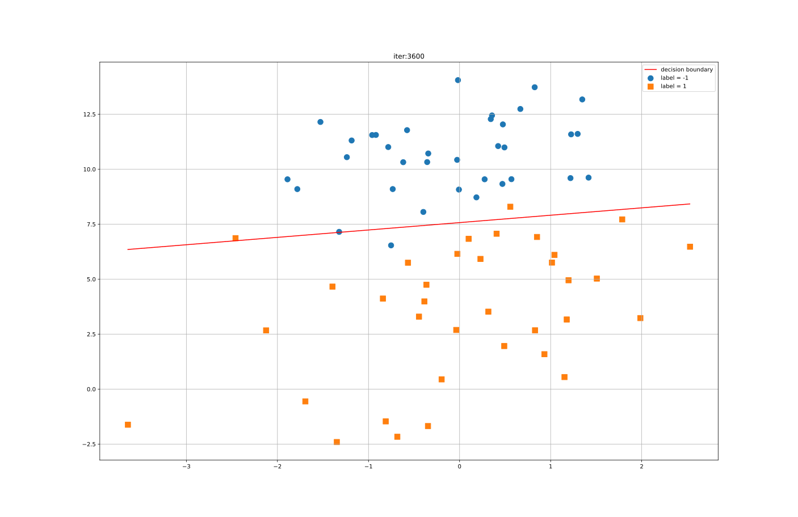
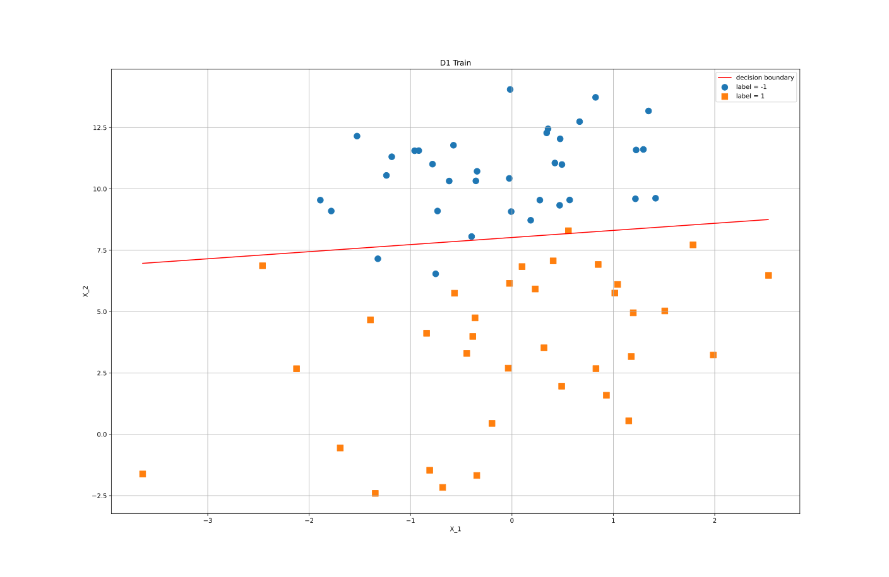
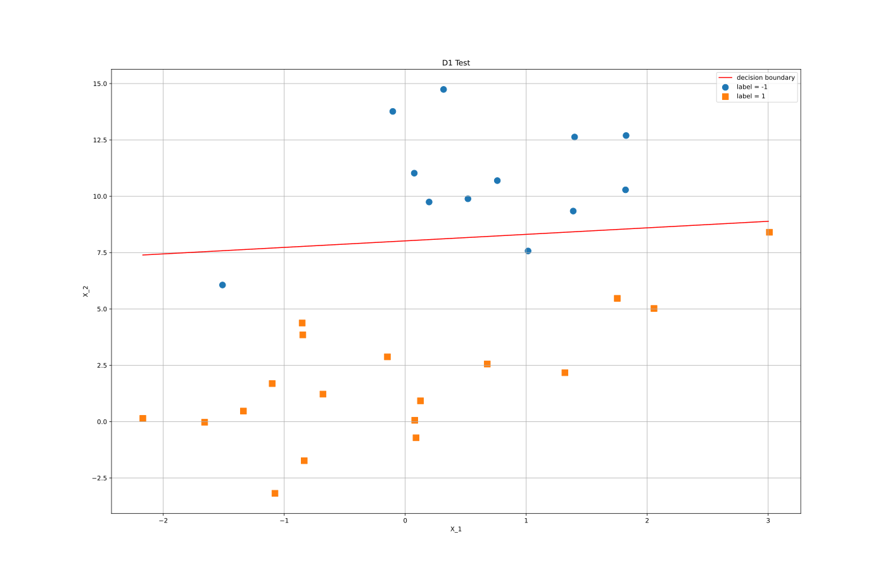

# SVM 实验

<center>PB18071477  敖旭扬</center>

## 选做的问题

**使用`数据集1`中数据，采用梯度下降法优化 SVM 模型**

## 原理

`数据集1`中的数据不是完全线性可分的，但是使用线性模型也可以较好地完成二分类任务，所以这里使用**软间隔线性 SVM**模型进行训练。由周志华的《机器学习》式$(6.35)$（或李航的《统计学习方法（第 2 版）》式$(7.32-7.34)$），线性不可分的线性支持向量机的学习问题变成如下凸二次规划问题：

$$
\underset{\boldsymbol{w},b,\xi}{min} \quad \frac 1 2 ||\boldsymbol{w}||^2 +  C \sum_{i=1}^N \xi_i\\\\ s.t.\ y_i(w\cdot x_i+b) \ge 1-\xi_i \\\\ \xi_i \ge 0, i=1,2,\cdots,N \tag{1}
$$

由于实验使用的数据噪声较大，使用`SVM.pptx`中给出的最简单的梯度下降算法时，训练过程中会出现剧烈的“抖动”，参数难以收敛，训练效果不好。即使对 $X$ 进行归一化可以改善效果，但是改善幅度并不明显，所以最终选择使用**Mini-Batch 梯度下降法（MBGD）**来求解该问题。使用该方法求得最优 $\boldsymbol{w}^*,b^*$ 后，分类决策函数即为：

$$
h(x)=sign(\boldsymbol{w}^* \cdot x+b^*) \tag{2}
$$

据此可用该模型对数据集进行预测，输出训练集和测试集的精度。

## 编程实现

矩阵运算使用`python`的`numpy`库实现。

最关键的**Mini-Batch 梯度下降法（MBGD）**算法如下

```python
class SVM:
    def __init__(self):
        self._w = self._b = self.Wb_save = None

    def fit(self, x, y, c=1, lr=0.01, batch_size=32, epoch=10000):
        n = len(x)
        batch_size = min(batch_size, n)
        self._w = np.zeros(x.shape[1])  # 用0初始化w，b
        self._b = 0
        save_step = int(epoch/100)  # 记下100组Wb
        self.Wb_save = []
        for i in range(epoch):
            if i % save_step == 0:
                self.Wb_save.append([self._w.copy(), self._b, i])
            self._w *= 1 - lr  # w的模的平方要尽量小
            # 随机选取 batch_size 个样本
            batch = np.random.choice(n, batch_size)
            x_batch = x[batch]
            y_batch = y[batch]
            err = 1 - y_batch * self.predict(x_batch, True)
            if np.max(err) <= 0:  # 最小化的函数第二项不能再优化
                continue
            mask = err > 0  # 分类错误的样本
            delta_v = lr * c * y_batch[mask]
            delta = delta_v.reshape(delta_v.shape[0], 1)
            self._w += np.mean(delta * x_batch[mask], axis=0)
            self._b += np.mean(delta)
        return self._w, self._b

    def predict(self, x, raw=False):
        y_pred = np.dot(x, self._w) + self._b
        if raw:
            return y_pred
        return np.sign(y_pred)
```

完整实验源码见压缩包中的`SVM.py`

## 运算结果

### 实例

在主函数中(详见源码)使用默认超参数调用下面的梯度下降实例

```python
svm = SVM()
W, b = svm.fit(x_train1, y_train1)  # 训练模型
```

命令行输出结果(每次运行的结果可能都不同)为

```text
W= [ 0.1776108  -0.61408069]
b= 4.925196423270461
数据集1的训练集精度为：95.71 %
数据集1的测试集精度为：93.33 %
```

### 动态展示迭代过程

<center>
    
    <br>
    <div style="color:orange; border-bottom: 1px solid #d9d9d9;
    display: inline-block;
    color: #999;
    padding: 2px;">数据集1的训练过程展示</div>
</center>

### 训练结果

<center>
    
    <br>
    <div style="color:orange; border-bottom: 1px solid #d9d9d9;
    display: inline-block;
    color: #999;
    padding: 2px;">最终结果在数据集1的训练集上的决策边界（精度95.71%）</div>
</center>

### 预测效果

<center>
    
    <br>
    <div style="color:orange; border-bottom: 1px solid #d9d9d9;
    display: inline-block;
    color: #999;
    padding: 2px;">最终结果在数据集1的测试集上的决策边界（精度93.33%）</div>
</center>

## 总结

题目要求的 Baseline 为

```text
测评指标：精度值，正确预测占整体的比例
训练集精度：0.9
测试集精度：0.85
```

我训练出的**软间隔线性 SVM 模型**训练集精度为 $95.71\%$，测试集精度为 $93.33\%$ ，性能达标。
