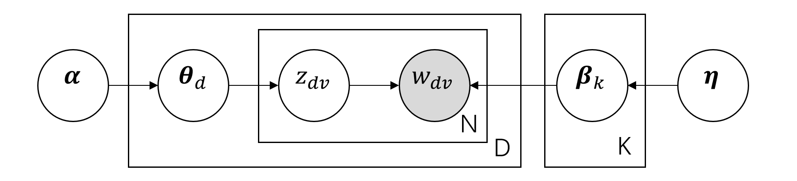

# Topic model 实验

<center>PB18071477  敖旭扬</center>

## 原理

`LDA`的概率图模型如下：



假定数据集中共含 $K$ 个话题和 $D$ 篇文档，词来自含 $V$ 个词的字典，观测数据为 $D$ 篇文档
$$
\mathcal{D}=\{\boldsymbol{d}_1,\boldsymbol{d}_2,\dots,\boldsymbol{d}_D\}
$$

其中每一篇文档
$$
\boldsymbol{d}_m=(w_{m,1},w_{m,2},\dots,w_{m,N_m})
$$
是一个单词序列， $w_{m,n}$ 和 $N_m$是第 $m$ 篇文档的第 $n$ 个单词和长度（单词数） 

单词集合为
$$
\mathcal{W}=\{w_1,w_2,\dots,w_V\}
$$

话题数量是提前给定的，话题集合为
$$
\mathcal{Z}=\{z_1,z_2,\dots,z_K\}
$$

`LDA`模型假设
$$
p(z|\boldsymbol{d}_m)\sim Mult(\boldsymbol{\theta}_m) \tag{1}
$$
$$
p(w|z_j)\sim Mult(\boldsymbol{\varphi}_j) \tag{2}
$$
其中 $\boldsymbol{\theta}_m$ 是所有 $K$ 个主题在文档 $\boldsymbol{d}_m$ 中出现的概率， $\boldsymbol{\varphi}_j$ 是所有 $V$ 个单词在主题 $z_j$ 中出现的概率

同时假设
$$
\boldsymbol{\theta}_m \sim Dir(\boldsymbol{\alpha}) \tag{3}
$$
$$
\boldsymbol{\varphi}_j \sim Dir(\boldsymbol{\beta}) \tag{4}
$$
其中 $\boldsymbol{\alpha} \in [0,1]^K$ 和 $\boldsymbol{\beta} \in [0,1]^V$ 是超参数，提前给定

生成文档 $\boldsymbol{d}_m$ 的过程：

* 从以 $\boldsymbol{\alpha}$ 为参数的狄利克雷分布中随机采样一个话题分布 $\boldsymbol{\theta}_m$
* 根据 $\boldsymbol{\theta}_m$ 进行话题指派，得到文档 $\boldsymbol{d}_m$ 中第 $n$ 词的话题 $z_{m,n}$
* 根据指派的话题 $z_{m,n}$ 所对应的的词分布随 $\boldsymbol{\varphi}_j$ 机采样生成词 $w_{m,n}$

求解模型时有
$$
\sum_{k=1}^{K}\theta_{mk}=1,\quad \sum_{v=1}^{V}\varphi_{jv}=1
$$
最后可得

$$
\theta_{mk}=\dfrac{\sigma_{jk}+\alpha_k}{\sum_{i}^{K}\sigma_{ji}+\alpha_i} \tag{5}
$$
$$
\varphi_{kv}=\dfrac{\delta_{kv}+\beta_v}{\sum_{r}^{V}\delta_{kr}+\beta_r} \tag{6}
$$
其中 $\sigma_{jk}$ 是第 $m$ 个文档第 $k$ 个主题的单词个数， $\delta_{kv}$ 是第 $k$ 个主题的第 $v$ 个单词个数

训练过程：

* 选择 $\boldsymbol{\alpha}$ 和 $\boldsymbol{\beta}$ 为全 $1$ 向量， $z$ 随机初始化
* 对于每篇文档 $d$ 的每个单词 $w$ ，重复吉布斯采样更新主题编号 $z_{d,w}$ 

## 编程实现

矩阵运算使用`python`的`numpy`库实现，部分文本预处理使用了`nltk`库的功能。

训练主要算法如下：

```python
class LDA:
    def gibbs_sampling(self, epoch=100):
        print("吉布斯采样......")
        for _ in tqdm.tqdm(range(epoch)):
            for m in range(self.D):
                for v in range(len(self.Dset[m])):
                    self.z[m][v] = self.topic_updated(m, v)

    def topic_updated(self, m, v):
        topic_old = int(self.z[m][v])
        self.delta[topic_old][self.Vset_to_index[self.Dset[m][v]]] -= 1
        self.n_k[topic_old] -= 1
        self.sigma[m][topic_old] -= 1
        self.n_m[m] -= 1
        p = np.zeros(self.K)
        for k in range(self.K):
            p[k] = (self.sigma[m][k] + self.alpha[k]) / \
                (self.n_m[m] + np.sum(self.alpha)) * \
                (self.delta[k][self.Vset_to_index[self.Dset[m][v]]] +
                 self.beta[self.Vset_to_index[self.Dset[m][v]]]) / \
                (self.n_k[k] + np.sum(self.beta))
        p = p / np.sum(p)
        topic_new = np.argmax(np.random.multinomial(1, p))
        self.delta[topic_new][self.Vset_to_index[self.Dset[m][v]]] += 1
        self.n_k[topic_new] += 1
        self.sigma[m][topic_new] += 1
        self.n_m[m] += 1
        return topic_new

    def cal_theta_varphi(self):
        for j in range(self.D):
            for k in range(self.K):
                self.theta[j][k] = (
                    self.sigma[j][k] + self.alpha[k]) / \
                    (self.n_m[j] + np.sum(self.alpha))
        for k in range(self.K):
            for v in range(self.V):
                self.varphi[k][v] = (
                    self.delta[k][v] + self.beta[v]) / \
                    (self.n_k[k] + np.sum(self.beta))

    def train(self, epoch):
        for m in range(self.D):
            self.n_m[m] = len(self.Dset[m])
            for v in range(len(self.Dset[m])):
                topic = int(np.random.randint(0, self.K))
                self.z[m][v] = topic
                self.delta[topic][self.Vset_to_index[self.Dset[m][v]]] += 1
                self.n_k[topic] += 1
                self.sigma[m][topic] += 1
        self.gibbs_sampling(epoch)
        self.cal_theta_varphi()
```

完整实验源码见压缩包中的[LDA.py](LDA.py)。

## 运算结果

### 实例


在主函数中调用下面的实例，其中 $\boldsymbol{\alpha}$ 和 $\boldsymbol{\beta}$ 为全 $1$ 向量

```python
texts = np.load("./data/text.npy")
lda = LDA(texts, K=20, cold_count=8)

# 训练模型
lda.train(60)

# 输出20个主题的top10的词
top10words = lda.top_words(10)
for i in range(lda.K):
    print(top10words[i])
    np.savetxt("top10words.txt", top10words, '%s', delimiter=',')
```

某一次运行后文件`top10words.txt`中为

```text
use,window,help,one,seem,two,problem,way,order,would
use,weapon,section,firearm,military,person,mean,shall,carry,license
would,make,think,say,good,people,god,like,know,one
copy,magi,new,issue,vote,would,cover,old,must,term
year,get,bike,one,food,billion,see,would,insurance,much
hiv,aid,disease,health,care,say,year,child,find,new
people,say,one,come,get,well,take,could,like,time
file,send,use,support,include,system,image,also,mail,graphic
please,point,anyone,well,post,really,every,know,email,time
israel,would,state,israeli,attack,lebanese,arab,time,true,jew
earth,space,launch,probe,program,would,mission,orbit,titan,year
find,point,sphere,level,new,plane,think,normal,sure,define
key,use,government,chip,one,system,encryption,need,get,make
drive,problem,hard,make,work,build,year,even,disk,space
game,play,good,goal,team,win,fan,get,last,blue
one,church,jesus,god,people,also,believe,christ,say,fact
greek,turkish,armenian,population,turk,show,jew,cyprus,jewish,child
card,monitor,thanks,use,need,cache,switch,color,port,anyone
get,like,car,know,would,thing,one,good,think,problem
space,power,use,data,april,option,science,flight,test,system

```

### 训练结果

<center>
    
    <br>
    <div style="color:orange; border-bottom: 1px solid #d9d9d9;
    display: inline-block;
    color: #999;
    padding: 2px;">主题top10关键词</div>
</center>


